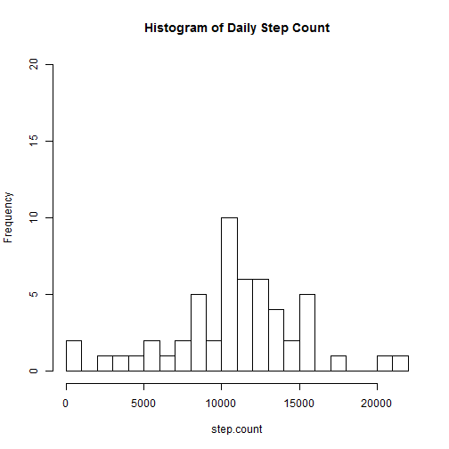
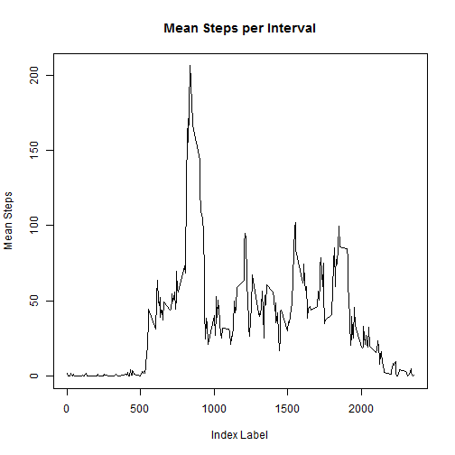
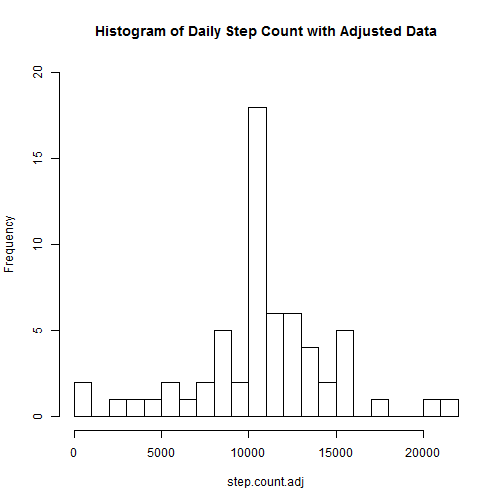
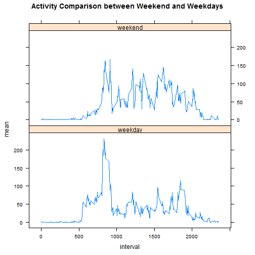

###Peer Assessment 1

####Setting up the Environment
For the first step in this analysis we clear the environment, set the working directory and load the appropriate libraries.

```r
rm(list=ls())
setwd("C:/Google Drive/71) Education/43) Coursera/Data Science - Johns Hopkins University/05 Reproducible Research/Projects/Project 1")
library(lattice)
```

####Loading the Data
The next step is to load the data and set the date as a date object.

```r
data <- read.csv(file="activity.csv",stringsAsFactors=FALSE)
data$date <- as.Date(data$date)
```

####Mean Steps Per Day
The next section of the analysis concerns the number of steps taken per day. First we will clean the data and remove the rows that have NA for step count.  Then we split the data by date and calculate the total step count for each day.

```r
data.cl <- data[!is.na(data$steps),]
data.date <- split(data.cl,data.cl$date)
step.count <- vector(mode="numeric",length=length(data.date))
for(i in seq_along(data.date)){
  data.date.sub <- data.date[[i]]
  step.count[i] <- sum(data.date.sub$steps)
}
```

Finally we create a histogram for the daily step count and then generate some simple statistics.

```r
hist(step.count,breaks=30,main="Histogram of Daily Step Count",ylim=c(0,20))
```

 

```r
mean.step.orig <- mean(step.count)
median.step.orig <- median(step.count)
```

```r
mean.step.orig
```

```
## [1] 10766
```

```r
median.step.orig
```

```
## [1] 10765
```

####Average Daily Activity Pattern
The first step for creating the average daily activity pattern is to split the data into sets according to the interval.  Then we compute the mean number of steps for each interval.

```r
data.interval <- split(data.cl,data.cl$interval)
interval.mean.df <- as.data.frame(unique(data.cl$interval))
names(interval.mean.df)[1] <- "interval"
interval.mean <- vector(mode="numeric",length=length(data.interval))
for(i in seq_along(data.interval)){
  data.interval.sub <- data.interval[[i]] 
  interval.mean[i] <- mean(data.interval.sub$steps)
}
interval.mean.df$mean <- interval.mean
```

Next we plot the number of steps for each interval.

```r
plot(interval.mean.df,type="l",main="Mean Steps per Interval",xlab="Index Label",ylab="Mean Steps")
```

 

Finally we computer the maximum of number of step and locate the interval where the maximum occurs.

```r
max(interval.mean.df$mean)
```

```
## [1] 206.2
```

```r
interval.mean.df$interval[which.max(interval.mean.df$mean)]
```

```
## [1] 835
```

####Imputing Missing Values
First we compute the number of rows with NAs

```r
length(data[is.na(data$steps),]$steps)
```

```
## [1] 2304
```

Next we fill those rows that contain NAs in the steps column with the average number of steps in each interval.

```r
data.adj <- data
for(i in 1:length(data.adj$steps)){
  if(is.na(data.adj$steps[i])){
     data.adj$steps[i] <- interval.mean.df$mean[which(data.adj$interval[i]==interval.mean.df$interval)]
  }
}
```

Then we count the number of steps for each day.

```r
data.date.adj <- split(data.adj,data.adj$date)
step.count.adj <- vector(mode="numeric",length=length(data.date.adj))
for(i in seq_along(data.date.adj)){
  data.date.adj.sub <- data.date.adj[[i]]
  step.count.adj[i] <- sum(data.date.adj.sub$steps)
}
```

Finally we plot the histogram and then compute the mean and median.

```r
hist(step.count.adj,breaks=30,main="Histogram of Daily Step Count with Adjusted Data",ylim=c(0,20))
```

 

```r
mean.step.adj <- mean(step.count)
median.step.adj <- median(step.count)
```

```r
mean.step.adj
```

```
## [1] 10766
```

```r
median.step.adj
```

```
## [1] 10765
```
Note that the historgram has changed however the means and medians have not.  This is an artifact of having replaced the NA with averages by interval.

####Differences in Activity Patterns
To look at the difference between weekdays and weekend days we first create a variable which distinguishes between weekdays and weekends.

```r
weekend <- c("Saturday","Sunday")
weekday <- c("Monday","Tuesday","Wednesday","Thursday","Friday")
data.adj$dofw <- weekdays(data.adj$date)
data.adj$worw <- vector(mode="logical",length=length(data.adj$date))
data.adj$worw[data.adj$dofw%in%weekend] <- "weekend"
data.adj$worw[data.adj$dofw%in%weekday] <- "weekday"
data.adj$worw <- as.factor(data.adj$worw)
```

Then we split the data by interval and by type and compute the means number of steps for each interval and day type.

```r
data.adj.interval <- split(data.adj,list(data.adj$interval,data.adj$worw))

interval.mean <- as.data.frame(vector(mode="numeric",length=length(data.adj.interval)))
names(interval.mean) <- "interval"
interval.mean$worw <- vector(mode="character",length=length(data.adj.interval))
interval.mean$mean <- vector(mode="numeric",length=length(data.adj.interval))
for(i in 1:length(data.adj.interval)){
  interval.mean.sub <- data.adj.interval[[i]]
  interval.mean$interval[i] <- interval.mean.sub$interval[1]
  interval.mean$worw[i] <- as.character(interval.mean.sub$worw[1])
  interval.mean$mean[i] <- mean(interval.mean.sub$steps)
}
```

Finally we create a panel plot to demonstrate the results.

```r
xyplot(mean~interval|worw,data=interval.mean,type="l",layout=c(1,2),main="Activity Comparison between Weekend and Weekdays")
```

 
